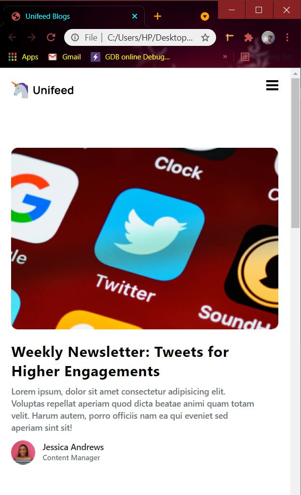
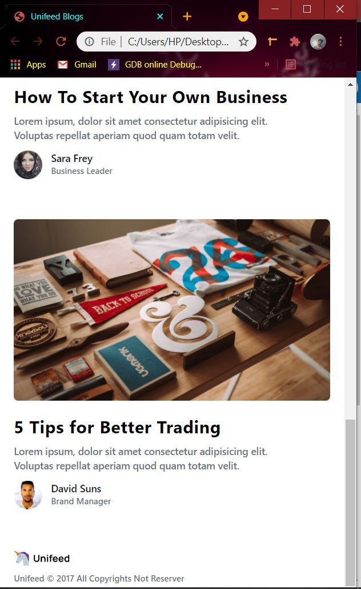
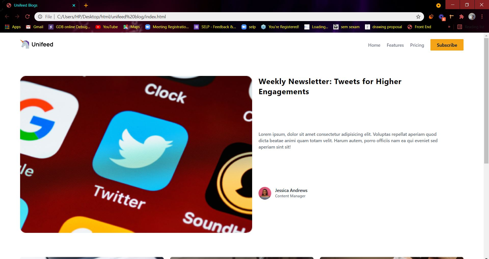
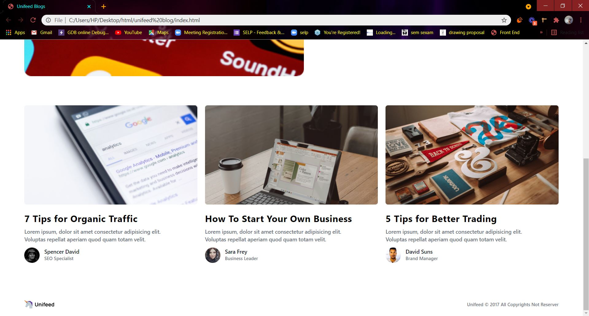

# Unifeed Blog Post Challenge

This is a Challenge accepted from [codewell](https://www.codewell.cc/challenges/unifeed-blog-page--608d9d5c747bad001532bd7c). It is static Landing page designed using Tailwind css.

[**click here to view the component**](https://harishkumaaran.github.io/unifeed-blog-post/)
&nbsp;

# screenshots
&nbsp;

### Mobile version

&nbsp;

&nbsp;

### Tablet version

&nbsp;

### Desktop version

&nbsp;

&nbsp;

&nbsp;

# Technology Stack
- HTML
- CSS
- Tailwind CSS

&nbsp;

# Credits
- This Unifeed blog post is done as a part of my Front end curriculum at Aekam Labs, Coimbatore.

